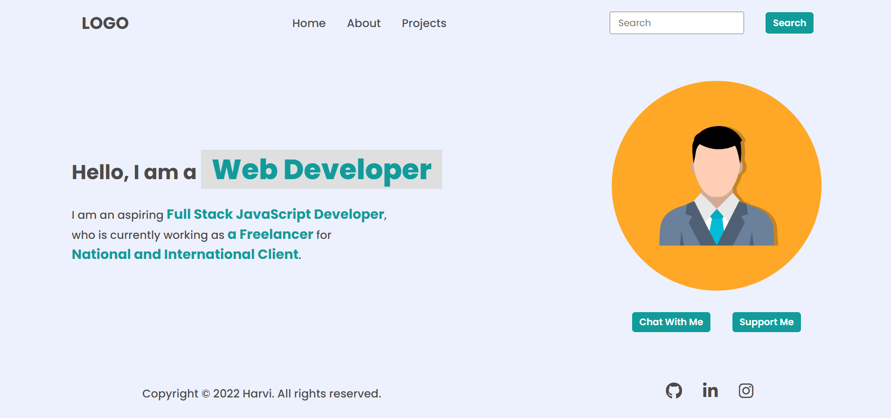

# DOM Assignments 1,2 and 3

## **Assignment  1 :** 
---
---

***Task 1*** :  Add a list item to the navigation section named " Hire Me ".


Ans. Code :👇

```
let nav_val=document.body.querySelector("nav ul");
let third_el=nav_val.querySelectorAll("a")
third_el[2].innerText="Projects"

const newLi = document.createElement("li");
newLi.innerHTML="<a>Hire Me</a>"
nav_val.appendChild(newLi);
```

___

***Task 2*** :  Replace the placeholder value from "Search" to "Search My Project" and remove "Hire Me" .


Ans. Code : 👇

```
let nav_val=document.body.querySelector("nav ul");
let third_el=nav_val.querySelectorAll("a")
third_el[2].innerText="Projects"

document.getElementsByTagName("input")[0].placeholder="Search My Project";
```
---


***Task 3*** : Change the innerText of 2nd and 3rd span element inside .hero-left-section > p tag.


Ans. Code : 👇

```
let spanList=document.querySelectorAll(".hero-left-section p span")
spanList[1].innerText="an Employee"
spanList[2].innerText="iNeuron Intelligence Pvt Ltd."
```
---

**Task 4** : Change the profile picture.


Ans. Code : 👇

```
let changeImage=document.querySelector(".hero-right-section img")
changeImage.src="./hitesh.jpg"
```
---

**Task 5** : Add a "Support Me" button aside of "chat with me button.



Ans. Code : 👇

```
let buttons=document.querySelector(".hero-right-section-btns")
let newButton=document.createElement("button");
newButton.innerText="Support Me"
buttons.appendChild(newButton)
```
---

## **Assignment  2 :** 
---
---

***TASK 1 :*** Change the backgroundColor of headings in "About section".


Ans. Code : 👇
```
let headingList=document.querySelectorAll(".accordian h3")
headingList.forEach( e=> e.style.backgroundColor="#DDDDDD" );
```
---

***TASK 2 :*** Add a Skills section in the about page.


Ans. Code: 👇

```
let list=document.body.querySelector(".accordian-wrapper")
let element=document.createElement("div")
element.innerHTML="<h3>Skills</h3> 
<p>I posses a very good command over the Full Stack Development technologies like MERN which can be seen in my work over the Github. </p>"
element.className="accordian"
list.appendChild(element)
```
---

## **Assignment  3 :** 
---
---

***TASK :*** Change the placeholder of both forms.


Ans. Code : 👇
```
document.querySelector(".enterName").placeholder="FSJS 2.0"
document.querySelector(".enterMail").placeholder="fsjs@ineuron.ai"
document.querySelector(".enterMessage").placeholder="Hello World"

document.querySelector(".userName").placeholder="FSJS 2.0"
document.querySelector(".userEmail").placeholder="fsjs@ineuron.ai"
document.querySelector(".userMessage").placeholder="Hello World"
```
---

# ❤️ Thank you for visiting 💚 !
---